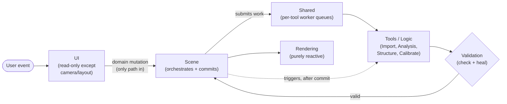
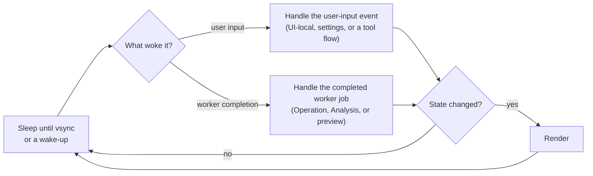
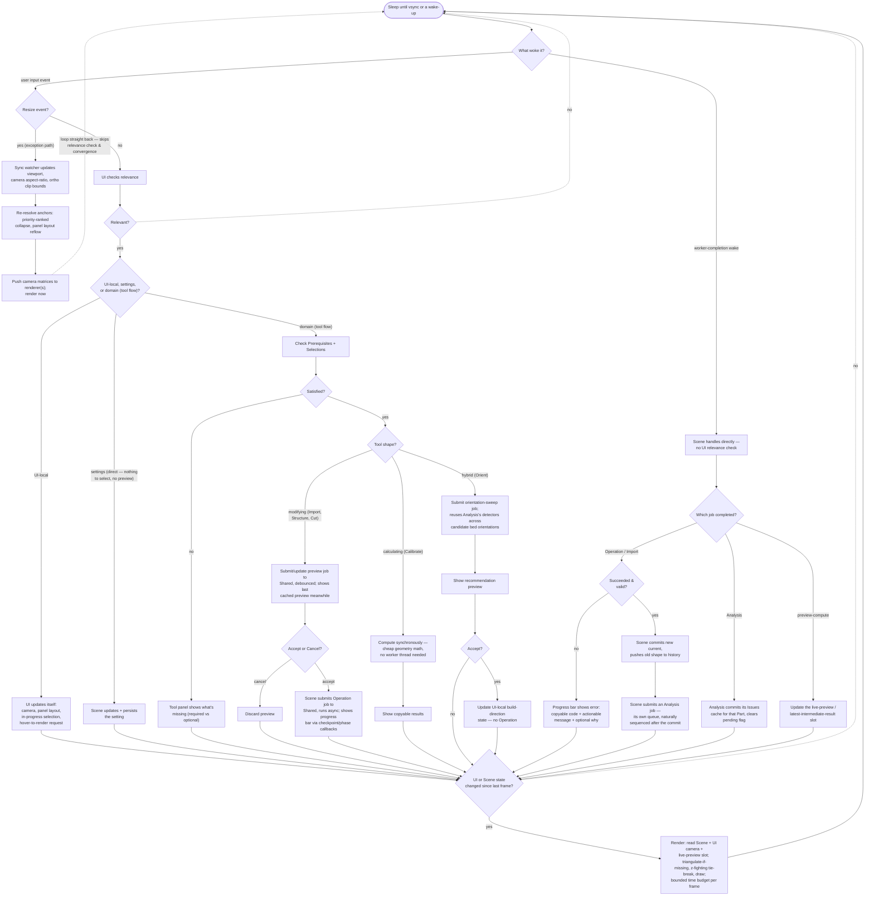
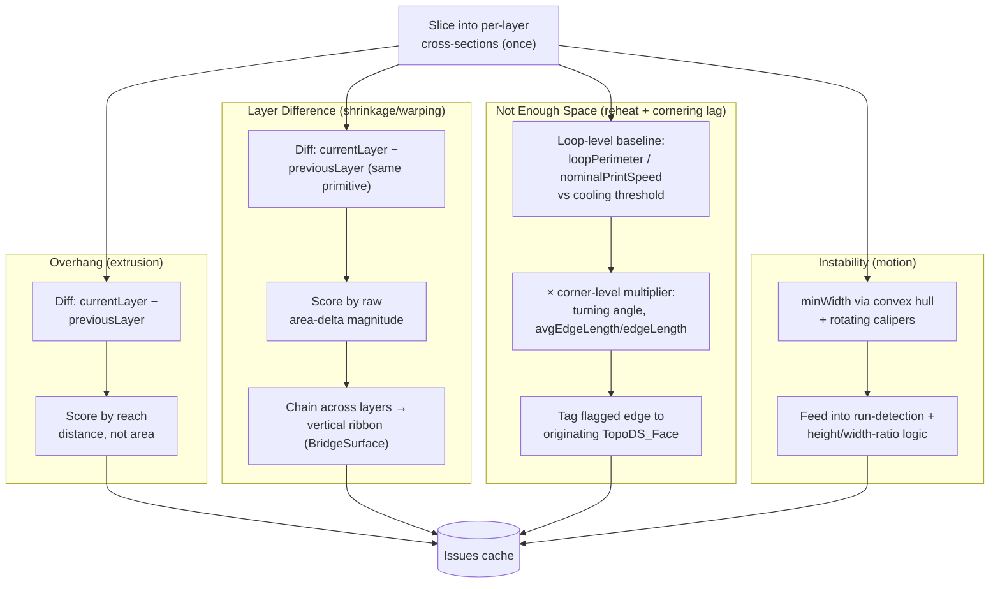
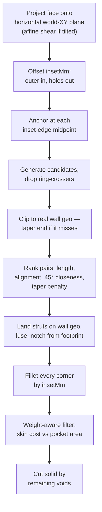
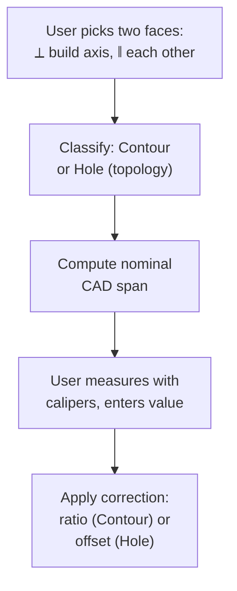
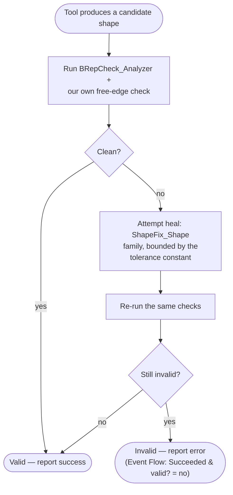

# Architecture

Decisions made before the rewrite: the domain model, the reasoning behind each decision, and the algorithms that follow from it. Coding conventions and practices (not domain algorithms) live in `practices/project_practices.md`.

## Contents
- [Product](#product)
- [Architecture at a glance](#architecture-at-a-glance)
- [Data](#data)
  - [Session](#session)
  - [Part](#part)
  - [Issue](#issue)
  - [Operation](#operation)
  - [Settings](#settings)
  - [Invariants](#invariants)
- [Architecture Layers](#architecture-layers)
  - [Scene](#scene)
  - [Logic](#logic)
  - [UI](#ui)
  - [Rendering](#rendering)
  - [Shared](#shared)
- [Event Flow](#event-flow)
- [Tools](#tools)
  - [Import](#import)
  - [Analysis](#analysis)
  - [Structure](#structure)
  - [Calibrate](#calibrate)
- [Validation](#validation)
- [Open Questions & Future Ideas](#open-questions--future-ideas)
- [What is explicitly out of scope](#what-is-explicitly-out-of-scope)

This doc goes a level deeper each section: [Product](#product) is the pitch, [Architecture at a glance](#architecture-at-a-glance) is one or two sentences per section below, everything from [Data](#data) onward is the full *how* and *why*. Stop reading whenever you have enough.

---

## Product

A 3D printing analyzer and toolset for FDM users who print functional parts and iterate often. Stays on the model side — not a slicer, doesn't need to know about specific printers.

**Two user intents:**
- "Will this part print correctly?" — diagnostic (Analysis)
- "How can I objectively improve this model?" — optimization (Structure)

**Tools:** Import, Analysis, Structure, Calibrate — see [Architecture at a glance](#architecture-at-a-glance) below.

The app flags problems and gives tools to fix them. It doesn't suggest fixes for arbitrary problems — size is the one planned exception (see [Open Questions & Future Ideas](#open-questions--future-ideas)).

---

## Architecture at a glance

One or two sentences per section below, plus a one-line *why* — just enough to know whether you need to read it. No algorithm; full depth follows, each section one level deeper than this.

- **[Data](#data)** — Session owns Parts; a Part owns only its current shape and undo history. Derived state (Issues, the picking index, the live-preview slot) is owned by whoever computes it, not bolted onto Part. OCCT's own shape hierarchy replaces the old pointer-based dependency graph.
  *Why:* settles "who owns this state" exactly once, so no two layers can quietly assume something different about the same entity.
- **[Architecture Layers](#architecture-layers)** — Scene orchestrates and commits; Logic computes (Analysis, Structure, Calibrate, Import); UI is read-only except its own camera/layout state; Rendering is purely reactive; Shared runs each tool's work on its own isolated worker queue, not a shared pool.
  *Why:* separates "deciding what happens to a Part" from "computing it," so a bug or hang in one tool's algorithm can't corrupt another tool's data or freeze the UI.
- **[Event Flow](#event-flow)** — the main thread sleeps until vsync or a wake-up, handles whichever event woke it, then renders only if something actually changed.
  *Why:* keeps the main thread idle whenever nothing's actually different, instead of spinning a busy frame loop.
- **[Tools](#tools)**:
  - **Import** — brings a model into the app (STL, OBJ, STEP, 3MF) and creates the first Part. Curved surfaces survive intact from STEP; mesh formats only recover flat faces.
    *Why:* a STEP model's curved faces are real surfaces in the source file — converting them to a mesh first would throw away precision the app doesn't need to lose.
  - **Analysis** — diagnostic, runs automatically after every change. Flags where the part is likely to fail when printed: overhang, not enough space, instability, layer difference — each tied to a specific physical cause in FDM printing.
    *Why:* a detector that isn't traceable to a real physical failure mode is just a guess — tying each one to a cause is what makes the threshold tunable instead of arbitrary.
  - **Structure** — optimization, the opposite direction from Analysis. Removes excess material/weight/print-time from an over-built region by carving out the interior and bracing the void with diagonal struts, without weakening the part.
    *Why:* redirects load from bending (where most of a solid panel's material does little work) into axial tension/compression, which carries load per unit mass far more efficiently.
  - **Calibrate** — tunes printer accuracy. Takes two real-world caliper measurements against their CAD-nominal values and computes the scale/offset corrections that account for nearly all systematic dimensional error in practice.
    *Why:* shrinkage and hole offset account for nearly all of a printer's dimensional error in practice — two corrections cover what would otherwise need modeling every possible error source.
- **[Validation](#validation)** — every tool's result is checked once at commit; OCCT supplies the repair primitives (closing gaps, fixing orientation), the app supplies the dispatch logic deciding which fixer applies to which detected problem.
  *Why:* makes "trust `current` unconditionally" (see Data → Invariants) an actual guarantee instead of an assumption every downstream reader has to re-verify.

The same shape, as one picture — every section above is one box or one arrow here, nothing deeper:

*Also rendered in [architecture-event-flow.png](architecture-event-flow.png), off to the side, for viewers without live Mermaid rendering. This is the only diagram that crosses section boundaries — it exists purely as an index of the shape, not a substitute for Event Flow's diagrams (the actual sequencing) or each tool's own (the actual algorithm).*

---

## Data

Each entity below is defined by what it owns — nothing more. Cross-cutting rules that span entities are in [Invariants](#invariants) at the end, not repeated per-entity.

**Why a Data section at all:** every other section in this doc depends on entities and ownership being settled in exactly one place. Architecture Layers describes who's *allowed* to write what; Event Flow describes *when* it changes; Tools describes *what* each produces; Validation describes what "valid" *means* — all four of those statements only parse if "what a Part owns" was already fixed before any of them were written. Settling it here, once, is what stops five layers from quietly assuming five different things about the same state.

### Session
The workspace. Owns one or more Parts, processed independently.

**Why:** the app has to support more than one Part open at once without their state bleeding into each other — a multi-document workspace, not a single-Part assumption baked into Scene itself.

### Part
The thing the user wants to print. Owns only what defines it:
- `TopoDS_Shape current` — the live geometry
- `vector<TopoDS_Shape> history` — undo stack, per-Part (cheap: OCCT shapes share underlying data)

`TopoDS_Shape`'s own hierarchy (Solid → Shell → Face → Wire → Edge → Vertex) *is* the dependency graph for what's inside `current` — there's no separate reference system to maintain. Sub-shape relationships are traversed via `TopExp_Explorer` on demand, and sub-shapes are identified by `TopoDS_Face` value comparison, never raw pointers — pointers go stale the moment a shape is rebuilt.

**Why:** keeping Part this narrow is what makes every other ownership rule in this doc possible — if Part also held Issues, the picking index, or any other derived state, "who owns this" would need re-deriving per consumer instead of being settled once (see Invariants).

### Issue
A specific problem at a specific location on a Part. Located by `TopoDS_Face` value, never a raw pointer. Owned by **Analysis**, a Logic tool — not Part (see [Invariants](#invariants) for why). A per-Part cache (`vector<Issue>` + a pending flag), cleared and recomputed whenever `current` changes; the pending flag drives the UI progress bar in the meantime.

**Why:** a flat pass/fail signal can't drive the UI — Analysis needs to say *where* on the Part each problem is and *what kind*, so a user can click an Issue and have the viewport highlight the exact face it's about. Tying it to a `TopoDS_Face` value, not a pointer, is what makes that mapping survive a shape rebuild.

### Operation
A modification applied to an *existing* Part (e.g. Structure). Always produces a new `TopoDS_Shape`, never mutates in place. Pushes `current` onto `history` and replaces it with the result. Undo is a pop.

On failure, an Operation reports one standard shape, not invented per-tool:
- A short, copyable **error code**.
- A short actionable **message** — what the user can do about it.
- An optional longer **why**, shown if there's room.

Import is not an Operation — it has no prior `current`/`history` to act on. It's a sibling concept that constructs a brand-new Part directly (`current` = the imported/healed shape, `history` empty). See Tools → Import.

**Why:** "always produces a new shape" is what makes undo just a pop off `history` instead of needing a separate undo-log or a deep-copy-before-mutate step — and it's what lets Validation check a result once, at commit, instead of every tool re-verifying state it might have silently corrupted in place.

### Settings
Persisted constants the user can tune (the tolerance constant, default tool parameters, etc.). The only thing in the app that persists across restarts — Sessions/Parts don't have a project-file format, since there's no need for one yet at this app's current scope. Same underlying persisted store either way, surfaced in two places:
- **Global** — most settings, on a general settings surface.
- **Tool-specific** (Structure's `insetMm`, `wallThicknessMm`) — on that tool's own panel instead, for better discoverability.

**Why:** the tolerance constant and tool defaults need to survive a restart, but Sessions/Parts don't — there's nothing to "resume" for an in-progress print analysis the way there is for a tuned setting, so only Settings gets a persisted store.

### Invariants

- **Derived state is owned by whoever computes it — not by Part, and not by Scene just because Scene triggered the work.** Part owns only what defines it (`current`, `history`). This covers Issues (Analysis), the picking index (Rendering), and the live-preview slot (Shared). Not a performance tradeoff: a lookup keyed by Part identity is a negligible hash-map access regardless of which side of this rule it lives on — this rule is about correct ownership, not speed.
- A Part's Issues are always defined in Analysis's cache — possibly empty, never unknown. While the pending flag is true, the cached Issues reflect the *previous* shape, not `current`.
- An Operation always produces a new shape; mutation in place is forbidden.
- Issues are cleared on every `current` change and recomputed before the UI sees the new state.
- Sub-shapes are referenced by value, never by raw pointer.
- Scene is the only layer that writes a Part's canonical state (`current`, `history`) and Settings — not the same claim as "Scene owns all state," per the rule above. UI is the only consumer that's purely read-only everywhere.
- A Part's `current` is always valid — validated once at commit (see Validation), never re-checked downstream. Anything reading `current` can trust it unconditionally.

---

## Architecture Layers

### Scene
Owns Session, Parts (`current`/`history` specifically), and the operation queue. The only layer that writes a Part's canonical state.

**Why:** orchestrates, doesn't compute — submits Logic tools' work to Shared's worker thread and commits what comes back onto a Part, without taking ownership of what a tool produces along the way (see Logic). Keeps "deciding what happens to a Part" separate from "computing it."

Also owns the **operation queue** — pending/in-progress Logic work on the worker thread. UI submits to it; rendering just reads a busy flag.

Uses the **tolerance constant** (owned/persisted by Settings, default grounded in real manufacturing/measurement resolution — ~0.001mm, finer than a printer can reproduce or a caliper can read) for two roles, one number feeding both, not picked independently per call site:
- Our own geometric comparisons — degenerate-loop checks, eligibility thresholds.
- The tolerance argument passed into OCCT APIs that accept one — sewing, face-fixing.

### Logic
Owns each tool's own domain computation and any tool-specific derived cache — Analysis's Issues, Structure's carve algorithm, Calibrate's correction formulas, Import's facet/sew/unify pipeline. This is where `src/logic/` (Analysis, Structure, Calibrate, Import, GeometryOps) actually runs.

**Why a separate layer:** distinct from Scene, which orchestrates but doesn't compute. Scene triggers Logic running and invokes it via Shared's worker thread, but that doesn't make them the same layer — what happens to a tool's result still depends on the tool:
- **Operations / Import** — hand a new shape back for Scene to commit.
- **Analysis** — exposes its Issues cache directly; nothing handed back to Scene.
- **Calibrate** — results are just read by UI; nothing committed at all.

A tool's result isn't "successful" until it's valid — see [Validation](#validation), the shared mechanism every tool's commit path goes through.

### UI
Drives imports, submits operations to Scene's queue, displays Issues and Part state. Never touches geometry directly. Owns the **camera** — it's what the user directly manipulates, so it's UI-local state, not a rendering decision, even though it feeds the render.

Resizing is a deliberate exception to the normal event flow — see Event Flow → Resize.

**Repositioning — anchor-based panel layout.** Panels and HUD elements don't use fixed pixel coordinates; each resolves its position from anchors (screen edges/corners) plus a content-box model (margin + padding + content, computed bottom-up). Resizing the window re-resolves every panel's box top-down, so panels reflow instead of needing per-resolution layout logic. Each parent element defines a local coordinate system; children position relative to their parent's, recursively — a standard scene-graph layout, not per-element absolute coordinates. The **viewport itself stays a fixed size** regardless of this — panels overlay it rather than resizing it, since visual stability of the 3D view matters more than reclaiming screen space when a panel collapses. Only an actual window resize retriggers the camera aspect-ratio/projection update, never a panel layout change alone.

**Sizing — priority-ranked progressive collapse.** Under space pressure, elements collapse in priority order rather than uniformly shrinking or clipping:
- Each element has a priority rank; lower-priority elements collapse first.
- Each collapse state has its own minimum size; the overall minimum is whatever the deepest non-collapsed element needs.
- If available space drops below the current minimum, collapse the lowest-priority element next, and recompute.
- What "collapse" means is element-specific (hide entirely, icon-only, re-wrap) — not one uniform behavior.

Units are computed from resolution and display scale (`SDL_GetWindowDisplayScale`), not raw pixels, so an element's *visual* size stays consistent across screen densities.

Tool panels split into modifying/calculating/hybrid shapes, with settings changes taking their own direct path — see Event Flow → Tool panel shapes. Live preview during a running operation is phase-level only, not continuous — see Event Flow → Live preview.

**Hover-to-render.** Anywhere the UI displays a reference to a sub-shape (an Issue's location, a selected face), hovering it highlights that feature in the viewport. This is the same picking index (`TopTools_IndexedMapOfShape`) Rendering owns for click-to-pick, just driven in reverse — no new infrastructure needed.

### Rendering
Purely reactive: no logic, no decisions, just reflects state Scene/UI already settled. Two separate gates, both required: vsync gates *when* a draw can happen (never more than once per refresh, in sync with the display — avoids tearing and wasted draws between refreshes); the state-changed check (Event Flow → convergence) gates *whether* it actually does — no redraw if nothing changed since the last frame, no per-frame recompute. Owns triangulation — reads cached triangulation from OCCT's faces, running `BRepMesh_IncrementalMesh` lazily on first draw if missing. Owns the **picking index** (`TopTools_IndexedMapOfShape` per Part) for mapping viewport clicks back to sub-shapes.

**Z-fighting — a depth tie-breaker, not a sort order.** The actual symptom is chaotic flicker: when two faces are this close in depth, which one wins the depth test can resolve inconsistently per-pixel or per-frame as the camera moves, reading as visual noise rather than a clean edge — not a clean, consistent "one face disappears." This app hits the precondition often: small faces nested inside or coplanar with a larger host face (a classified sub-face, a Structure preview overlay). When two faces are within the tolerance constant's depth range of each other (a genuine tie, not just nearby in depth), bias whichever has the smaller projected screen area toward the camera — deterministic, so the flicker has a fixed winner instead of an unstable one. That also keeps the smaller face reliably visible and pickable as a side effect, rather than it winning or losing at random. This only resolves real ties — it doesn't reorder normal, legitimately depth-separated geometry, since there's no tie to break there.

**Fog for depth cueing** — a separate concern from z-fighting: a perceptual aid helping the user visually judge which face is in front, not a fix for a rendering artifact.

Considered and rejected: shader-based tessellation instead of `BRepMesh_IncrementalMesh`. Faster, but it means re-implementing OCCT's surface evaluation (planes, cylinders, NURBS, trimmed surfaces) in GLSL, for limited hardware support — and no profiling shows CPU-side triangulation is actually a bottleneck at this app's scale (a handful of Parts, cached results). Revisit only if that changes.

### Shared
Logic work runs on worker threads, isolated **per tool** — not one shared pool. The main thread owns UI and rendering and never blocks.

Each tool owns its own queue and worker(s), not only because OCCT can hang, but because a tool's own algorithm can too — a bug or pathological case in one tool's code must not be able to starve another tool's queue. Already proven necessary in practice, not hypothetical: Structure's carve already runs on its own isolated runner today, specifically because a stuck case could otherwise starve Import/Analysis's shared queue. This generalizes that fix to every tool instead of leaving it a one-off special case.

Considered and rejected: running two tools concurrently on one Part's disjoint faces, if each can prove it never touches the other's faces. Doesn't hold up for two reasons — OCCT's coplanar-merge/topology-rebuild steps can touch neighboring faces even when a carve's intent is local, so disjointness is hard to prove in the first place; and even if proven, two independently-computed results still need merging back into one `current` afterward, which OCCT has no general primitive for. Most realistic same-Part tool pairs aren't parallelism candidates anyway: Analysis always runs strictly after an Operation commits (a data dependency, not an opportunity), and Calibrate is synchronous/read-only already.

**Algorithm, per tool's queue:**

1. Scene submits a unit of work to that tool's task queue (`fn` receives a cancellation token it can check cooperatively during long calls). Submission is non-blocking — it enqueues the job and immediately returns a handle wrapping a future; the caller does not wait. At most one in-flight job per (tool, Part) — if the user submits a new job for a tool already running on that Part, it queues behind it rather than rejecting or cancel-superseding; simple and safe, since most jobs are quick enough that the wait is brief.
2. That tool's worker(s) pull queued jobs FIFO and run them off the main thread.
3. On completion, the job wakes the main thread's blocked event wait — so the main thread discovers the result without polling every frame.
4. The main thread polls the handle (non-blocking by default) to check if the result is ready, and if so commits it — e.g. Scene swaps in the new shape (once validated, see [Validation](#validation)) and triggers Analysis to recompute its cache for that Part.
5. Cancellation is cooperative only: requesting cancellation flips a flag; the running task must check it itself to actually stop early — there's no preemption.
6. Teardown never blocks the main thread: destroying a handle whose result isn't ready yet gets a bounded grace wait (about one frame), then any further wait is deferred to a detached thread instead of blocking — some calls can hang indefinitely, and blocking on cleanup would freeze the UI.

---

## Event Flow

The main thread sleeps at vsync — it isn't spinning a frame loop when nothing's happening. UI is the only layer that listens for input events; a worker-completion wake is a second, separate way the loop wakes, handled directly by Scene with no relevance check, since Scene already knows the work it submitted matters.

**The shape, before the detail:**

Two wake sources, each handled, then one shared convergence check before render. Everything below is what "handle the user-input event" and "handle the completed worker job" actually dispatch to — the same loop, every branch:

*Each Mermaid block in this doc (this overview, the detailed loop below, Architecture at a glance's overview, Analysis's algorithm, Structure's algorithm, Calibrate's algorithm, and Validation's) is its own source of truth, kept separately editable. [architecture-event-flow.png](architecture-event-flow.png) is one combined generated snapshot of all seven, for viewers that don't render Mermaid live — not seven separate files, so there's one image to find. The other six diagrams render off to the side, each in its own labeled box — none graph-connected to each other. Analysis's diagram includes its detectors' internal steps directly inside each detector's box — deliberately not split into a second diagram, since that split read as "missing" rather than "more detail available" to a reader without the surrounding context.*

*Regenerate after editing any of the seven: extract each block, wrap the other six in labeled subgraphs nested inside one outer `Side` subgraph, link `Main ~~~ Side` (an invisible Mermaid edge — layout hint only, draws nothing) so the renderer places them beside the main loop instead of stacking everything vertically, then render the combined source once: `npx -y @mermaid-js/mermaid-cli -i <combined .mmd> -o architecture-event-flow.png -b white -w 7000 -s 2`. High resolution so it stays readable when zoomed; if your viewer always shrinks images to a fixed thumbnail, open the file directly rather than relying on an inline preview.

Node/subgraph IDs must be unique across the *entire* combined source, not just within one diagram's original block — Mermaid silently merges same-named nodes/subgraphs from different diagrams into one, which is what caused the Not Enough Space detector to render outside its own group the first time (its subgraph ID collided with the fan-out diagram's `NES` node).*

This lets UI handle its own presentation without routing every camera nudge through Scene, while still funneling all domain mutations through one writer, and keeps the main thread idle whenever nothing has actually changed.

### Resize — a deliberate exception
A window resize doesn't go through the normal relevance-check-then-update path: an OS-level event watcher intercepts `SDL_EVENT_WINDOW_RESIZED` synchronously and updates state immediately, including an immediate render call, rather than waiting for the next reactive wake. This is justified, not a shortcut: deferring to the next polled frame would show a stretched or stale frame for one visible frame during an interactive resize drag — a real artifact, not just a layering nicety being skipped for convenience. The viewport update uses physical pixels for HiDPI/Retina correctness, while logical size still drives camera/UI math. The viewport itself stays a fixed size regardless of panel layout — panels overlay it rather than resizing it, since visual stability of the 3D view matters more than reclaiming screen space when a panel collapses.

### Tool panel shapes
- **Modifying** (Structure, future Cut, and Import — which creates a Part instead of modifying one, but follows the same shape) — preview the result, then Cancel/Accept; only Accept commits.
- **Calculating** (Calibrate) — read-only, ends in copyable results instead of an accept step.
- **Hybrid** (Orient) — calculates a recommendation, but an Accept step changes UI-local build-direction state rather than committing an Operation.

A settings change isn't a third tool-panel shape — it skips this machinery entirely. It mutates domain state (so it's not UI-local), but there's nothing to select and no preview to show, so it doesn't belong behind the Prerequisites + Selections gate either. It's its own direct path: Scene updates and persists the value.

### Live preview — phase-level only, not continuous
Two different things this could mean: **phase-level snapshots** (showing the shape as of the last completed checkpoint while the next phase computes) are genuinely practical — a checkpointed operation (Structure's carve) produces a real, valid intermediate `TopoDS_Shape` at each phase boundary, and `TopoDS_Shape` value semantics make it cheap to hand a copy back to the main thread mid-operation. This needs one small addition to Shared: a future only resolves once, so delivering several intermediate shapes over one operation's lifetime needs a separate "latest intermediate result" slot the worker updates between phases. Shared owns that slot (see Invariants); Scene/Rendering only read it.

**Continuous frame-by-frame animation of a single OCCT call in progress** is not achievable on any graphics API: `BRepAlgoAPI_*` calls are atomic black boxes with no mid-call hook, because there's no valid shape to expose until the call returns. This isn't a rendering limitation to solve — the data doesn't exist. Not a reason to consider Vulkan either: the actual constraint here was never render-thread parallelism (this app draws a handful of Parts with cached triangulation — nowhere near the draw-call volume where Vulkan's multithreaded command recording pays off), and a graphics-API swap wouldn't expose OCCT's internal call state regardless.

### Worker-completion handling
An Operation/Import completion checks **success and validity** before committing anything — failure (whether the algorithm errored, or it ran clean but produced an invalid shape that couldn't be healed, see [Validation](#validation)) shows the standardized error (code, message, optional why) in the same progress bar, rather than silently discarding the result or leaving stale state. On success, Scene commits the new shape and submits Analysis as its own job, on Analysis's own queue, naturally sequenced after the commit — Analysis exposes its own Issues cache directly rather than handing anything back to Scene, per the Logic layer's split above. A live-preview-slot update from an in-progress preview job follows the same no-relevance-check path, since it's also Scene-initiated work completing, not user input.

---

## Tools

Surface-level summary of each tool. Deeper design docs are linked where they exist. Collectively, these are the **Logic** layer (see Architecture Layers → Logic) — Scene orchestrates and commits, Logic computes.

Each tool follows the same shape:
1. A one-line summary.
2. **Why** — the reasoning, where the one-liner doesn't already make it obvious.
3. **Algorithm** (if designed) or **Status** (if not).

Open items and future tools are consolidated in [Open Questions & Future Ideas](#open-questions--future-ideas) instead of inline — keeps this section to what each tool currently is.

### Import
Not an Operation — it has no prior Part to act on. Constructs a brand-new Part directly. Supports STL, OBJ, STEP, 3MF, and likely a scan-mesh format (PLY, to confirm) — drop it if it turns out complex; it's a nice-to-have, not core.

**Algorithm:** STEP imports as native BRep via `STEPControl_Reader` — true curved surfaces, no conversion needed. The mesh formats (STL/OBJ/3MF) go through facet → sew → unify: one planar face per triangle (`BRepBuilderAPI_MakeFace`), sewn (`BRepBuilderAPI_Sewing`), then `ShapeUpgrade_UnifySameDomain` merges adjacent *coplanar* triangles into larger flat faces. That only recovers flat faces — a tessellated cylinder stays a faceted prism, since there's no surface-fitting step that reconstructs curved faces from a triangle mesh.

### Analysis
Diagnostic. Runs automatically whenever a Part's `current` changes, recomputing its own per-Part Issues cache (see [Data → Issue](#issue)). Full derivation and uncalibrated constants: [analysis-redesign.md](todo/analysis-redesign.md).

**Why:** each detector ties to a specific physical cause in the FDM process. New detectors should be justified the same way, not bolted on ad hoc:

- **Overhang** (extrusion) — nozzle pressure/momentum pushes unsupported material sideways. Not gravity-driven — happens upside-down too.
- **Not Enough Space** (reheat + cornering motion lag) — two independent, compounding mechanisms:
  - *Reheat* (loop-level): a small loop has a short perimeter, so the nozzle revisits it before it cools. Severity tracks loop size/shape, not shrinkage — no global factor fixes it, so it must be flagged geometrically.
  - *Cornering motion lag* (corner-level): the nozzle decelerates into a sharp corner; extrusion lags the velocity change (what pressure/linear advance imperfectly compensates), over-extruding locally, independent of loop size.
- **Instability** (motion) — a tall thin section topples under disturbance, like Euler buckling: a column yields along its weakest axis, not its average width.
- **Layer Difference** (shrinkage/warping) — differential cooling shrinks the part. Uniform across the whole part (unlike reheat), so Calibrate's single scale factor corrects it — Analysis just flags where the area-delta is large enough to signal risk.

**Algorithm, per Part:** one shared slicing step, then four *independent* detectors — not a sequence; 2-5 below don't depend on each other, only on 1:

*Rendered in [architecture-event-flow.png](architecture-event-flow.png), off to the side of the main loop — see Event Flow for the regeneration recipe. Each detector's internal compute → score (→ map) steps are right there in the box — nothing is split into a second diagram.*

1. Slice into per-layer cross-sections once, shared by all four detectors below.
2. **Overhang**:
   - **Diff** — boolean diff `currentLayer − previousLayer` gives the unsupported region directly.
   - **Scoring** — threshold on **reach distance** (how far the diff region extends past the supported edge), not area: a long thin sliver that cantilevers far is the failure case, not a short wide strip with more area but little reach. Area stays as a secondary signal.
3. **Layer Difference**:
   - **Diff** — the same diff primitive as Overhang (`currentLayer − previousLayer`).
   - **Scoring** — thresholded on raw area-delta magnitude instead of reach: warping is about how much cross-sectional area shifted, not which direction it's unsupported in.
   - **Mapping** — not a single-face defect: flagged regions chain across consecutive layers into a vertical ribbon (`BridgeSurface`), since warping runs through the part's height, not one face.
4. **Not Enough Space** — per loop: `risk = loopReheatRisk(loopPerimeter, nominalPrintSpeed) * (1 + cornerDwellBonus)`.
   - **Loop-level baseline** (`loopReheatRisk`) — estimated revisit time (`loopPerimeter / nominalPrintSpeed`) compared against a cooling threshold.
   - **Corner-level multiplier** (`cornerDwellBonus`) — scores each corner's turning angle, and each edge's length *relative to the loop's own average* (`avgEdgeLength / edgeLength` — the short edge must be the denominator, or the ratio backwards-favors long edges).
   - **Face mapping** — each corner is tagged with its originating `TopoDS_Face` at slice time, so the flag becomes a clip region on that face, not the whole loop.
5. **Instability**, per loop:
   - **Computation** — `minWidth` via convex hull + rotating calipers (a convex polygon's minimum width is always perpendicular to one of its hull edges, so only as many directions as hull edges need checking).
   - **Scoring** — feed `minWidth` into the run-detection + height/width-ratio logic, flagging a run of layers whose minimum width is small relative to how tall the run is.

### Structure
Optimization, the opposite direction from Analysis: removes material/weight/print-time from an over-built region without weakening it. An **Operation** — produces a new shape via OCCT carve/fillet/offset/boolean primitives (`GeometryOps`).

**Mechanism:** the tool auto-selects every eligible face (near-horizontal, large enough span) — the user excludes faces, rather than picking them in. Per remaining face: inset the boundary by `insetMm` (holes get an outset, untouched), carve away the interior (vertical prism subtraction), then brace the void with diagonal struts anchored to the remaining wall band.

The carve is always **vertical** — never angled — so it never introduces an overhang. A carve that left an unsupported angled wall would just trade one defect for another, so this constraint is load-bearing, not a shortcut.

**Why:**

- **Bending → axial conversion.** A solid panel resists load mainly via bending stiffness (scales with thickness³) — material in the middle of a thick slab does little work relative to material at the boundary. Diagonal struts redirect that load into axial tension/compression instead, which carries load per unit mass far more efficiently — the same principle behind trusses and I-beams.
- **Corners outlast walls.** Not because the filament there is stronger — it's the same material everywhere. A flat wall span is like a simply-supported plate: unsupported mid-span, so it deflects most there. A corner is braced on two sides, like an L-bracket vs. a flat sheet — stiffer by geometry, not material. FDM's flexible filament and weak inter-layer bonding make this more *visible*, but the cause is leverage, not "weak walls." This is also why inset distance, not material choice, is the real safety lever.
- **Fillets at strut/wall junctions cut stress concentration.** A sharp internal corner is a textbook stress riser — a real, quantifiable factor (2-3x vs. a filleted one). Real mechanical work, not cosmetic.

**Algorithm, per eligible face:**

1. Project the face onto the horizontal world-XY cutting plane (slanted faces project tilted, via an affine shear, so a circular hole still carves a cylinder wall instead of a polygon prism).
2. Offset by `insetMm`: outer boundary inward, hole loops outward (untouched).
3. Place an anchor at each inset-edge midpoint, carrying that edge's inward normal.
4. Generate strut candidates between anchor pairs, dropping any that cross a ring boundary (outer or hole) or whose midpoint falls outside the outer ring or inside a hole's void.
5. Clip each surviving candidate against its own walls' real geometry (an OCCT boolean, not a 2D approximation) — an end that doesn't land squarely on the wall it's connecting to **tapers** narrower than `insetMm/2` instead of being rejected outright, since a tapered strut is still buildable and may be the only option at that anchor.
6. Rank valid pairs on four terms:
   - Combined length.
   - Bisector alignment with the edge's inward normal.
   - **Closeness to 45° from the walls each strut touches** — the mechanically optimal angle for the bending→axial conversion above, so it needs its own term, not just length/alignment.
   - **Taper penalty** — a tapered tip carries less material than its length alone suggests, so it loses to a full-width alternative when one exists, but still wins over no strut at all.
7. Land surviving strut quads on the real wall geometry, fuse overlapping ones, then **notch them out of** the offset footprint — the void is footprint *minus* struts.
8. Fillet every corner by `insetMm` (radius = inset, 1:1).
9. Weight-aware filter: per disjoint void pocket, compare wall-skin cost (`perimeter * wallThicknessMm`) to the pocket's own area. Fill back to solid if skinning costs more than the pocket saves.
10. Cut the solid by the remaining voids: full Z slab for near-horizontal faces, `min(face Z)` to solid top for slanted ones.

*Also rendered in [architecture-event-flow.png](architecture-event-flow.png), off to the side, for viewers without live Mermaid rendering.*

### Calibrate
Diagnostic-adjacent. Read-only — never mutates `current`, not an Operation, no history entry.

**Why:** a tool to automate tuning printer accuracy, distilled to the two corrections that account for nearly all of it in practice: shrinkage (Contour) and an unexplained hole-specific offset (Hole). A third, **elephant's foot**, was considered and dropped — it needs a genuinely different pick interaction (two *edges* on one cap, vs. two *faces* for Contour/Hole — a structurally separate interaction model, not a UI variation), and unlike Contour/Hole error it's fixable after the fact via post-processing, so it wasn't worth the added interaction complexity.

**Algorithm:**

1. User picks two faces: both perpendicular to the build axis (keeps the measurement in-plane, independent of Z calibration) and parallel to each other (a caliper reading only means something between parallel planes).
2. Classify the pick as **Contour** or **Hole** by topology (does either face touch a hole-inner-edge). Can't mix Contour with Hole — that conflates two distinct, independently-tuned error sources.
3. Compute the nominal CAD span: perpendicular distance between the two picked planes.
4. User measures the print with calipers, enters the value.
5. Apply the matching correction:
   - **Contour**: `contourScale = nominal / measured` — a ratio, since shrinkage scales proportionally with the part.
   - **Hole**: `holeRadiusOffsetMm = 0.5 * (nominal - measured)` — an absolute offset, since hole error doesn't scale with diameter the way Contour error scales with span.

*Also rendered in [architecture-event-flow.png](architecture-event-flow.png), off to the side, for viewers without live Mermaid rendering.*

---

## Validation

A tool's result isn't "successful" until it's valid. Validation happens once, at commit — never re-checked by downstream consumers, so anything reading a Part's `current` (Analysis, Rendering, future tools) can trust it unconditionally. Lives in `GeometryOps` as a shared utility every tool's commit path calls, not reinvented per-tool — the same pattern `GeometryOps` already follows for other generic OCCT primitives (offset, fillet, boolean, ring math).

**Why:** OCCT operations (booleans, fillets, mesh-to-BRep conversion) can produce shapes that are topologically well-formed by OCCT's own rules but geometrically broken in ways that corrupt slicing or printing if left uncaught. Validating in one shared place, rather than each tool inventing its own ad hoc check, is what makes the "trust `current` unconditionally" guarantee actually hold.

OCCT's `ShapeFix` package supplies the actual repair *primitives* — closing a gap, fixing a curve-on-surface mismatch, correcting orientation. We don't reimplement geometric healing; that would be reinventing a CAD kernel. What's ours is the **dispatch**: deciding which specific fixer applies to which detected problem, what tolerance bounds it, and what happens if it still fails afterward. There's no one generic "fix it" call — each type below routes to a different tool, on purpose.

**Types & fixes:**
- **Not watertight** — a free edge (used by only one face) means the shell doesn't enclose a defined volume; Analysis can't slice an open shell into meaningful cross-sections. Detection: build an edge→face adjacency map (`TopExp::MapShapesAndAncestors`) and flag any edge whose face count is 1 instead of 2. Fix: re-run a sewing pass (`BRepBuilderAPI_Sewing`, the same tool Import already uses) at the tolerance constant's value — the same mechanism, just applied again post-operation, snapping free-edge endpoints that are only slightly apart. Unrecoverable if the gap is wider than tolerance — that's a real hole in the source, not a numerical artifact, and gets reported rather than forced shut.
- **Inconsistent orientation / self-intersection** — face normals disagreeing about which side is "outside," or a trimmed surface intersecting itself. Detection: `BRepCheck_Analyzer`, walking the shape and reporting per-sub-shape status. Fix: `ShapeFix_Face` (one bad face) or `ShapeFix_Shape` (shape-wide) re-derives consistent orientation and, where possible, re-trims a self-intersecting surface along the intersection curve — the exact mechanism already proven for Structure's fillet path (`ShapeFix_Face` inside `FilletFaceWithChFi2d`), generalized here instead of staying that one tool's special case. Unrecoverable if the self-intersection is severe enough that re-trimming can't produce two well-bounded faces — rare, but possible after an extreme boolean.
- **Tolerance violation** — two points meant to be coincident (a sewing seam, a boolean cut boundary) sit farther apart than the shape's tolerance. Detection: `BRepCheck_Analyzer`'s tolerance-related statuses, or comparing a known-coincident pair directly against the tolerance constant. Fix: `ShapeFix_Shape`'s gap-closing, explicitly bounded to the tolerance constant's value — healing can never widen the *effective* tolerance beyond what we've already decided is acceptable elsewhere, so it can't quietly make the model less precise than the rest of the app assumes.
- **Degenerate sub-shapes** — zero-area faces, zero-length edges. Detection: area/length checks per face/edge against the tolerance constant. Fix: removed rather than repaired — there's no meaningful fix for a sub-shape with no real extent — followed by `ShapeUpgrade_UnifySameDomain` to re-merge whatever coplanar faces the deletion exposed.

**Not a type:** a sub-shape shared by 3+ faces (e.g. two faces resolved out of a self-intersection by splitting along the intersection curve, which legitimately produces this). `BRepCheck_Analyzer` doesn't flag it — it's checking BRep consistency, not manifold-ness for printability, and there'd be nothing for `ShapeFix` to fix since the data structure is correct. Rejecting it would also contradict the self-intersection fix above: that fix's correct output *is* this shape. If a near-zero-width pinch ever matters physically, that's an Analysis concern (Instability's `minWidth` already watches for vanishing cross-sections), not a Validation one.

**Algorithm:** check → if clean, done → if not, dispatch to the matching fixer → re-check → still broken is the "no" branch of `Succeeded & valid?`, healed is "yes".

1. Run `BRepCheck_Analyzer`, plus our own free-edge check (manifold/printability concerns it doesn't cover).
2. Clean → done, report success.
3. Not clean → dispatch to the matching fixer from Types & fixes above — which problem determines which `ShapeFix` tool, not one generic call — bounded by the tolerance constant.
4. Re-run the same checks on the healed result.
5. Still invalid → report the standardized error, don't commit (Event Flow: `Succeeded & valid?` = no). Otherwise → report success, commit.

*Also rendered in [architecture-event-flow.png](architecture-event-flow.png), off to the side, for viewers without live Mermaid rendering.*

---

## Open Questions & Future Ideas

**Future tools** — not designed yet; it'll be a while before either is picked up:
- **Tolerance** — clearance/fit adjustment between mating parts. Likely scoped to face-tagging (user marks press-fit/smooth-motion-fit faces) rather than full assembly modeling, lighter-weight than tracking relative Part transforms. 3MF's multi-object support could be a future source of relative positioning if that ever matters.
- **Cut** — divides an oversized part into printable pieces. The one tool that would be allowed to suggest an explicit fix rather than just flag a problem.

**Deferred:**
- **Orient** — not yet implemented. Re-runs Analysis's detectors across candidate bed orientations, recommends/previews whichever minimizes overhang/instability/layer-difference signals; changes build direction, not the shape. The orientation-search itself (how candidates are generated/scored beyond reusing Analysis's detectors) isn't designed. Open question whether accepting a recommendation needs an Operation/history entry, or is purely UI-local state like Calibrate's build-direction vector.

**Per-tool open items:**
- **Analysis** — Not Enough Space's cooling threshold and corner-multiplier weight are uncalibrated, pending print experiments. OCCT boolean cost on continuously-changing cross-sections is an open perf risk — profile before picking a fix. See [analysis-redesign.md](todo/analysis-redesign.md).
- **Import** — an optional "attempt curve reconstruction" toggle (off by default, recovering only flat faces; on, attempts to fit arcs/curved surfaces from the tessellation) depends on a mesh-to-BRep surface-fitting capability that doesn't exist yet — no confirmed turnkey OCCT solution for it.

---

## What is explicitly out of scope

- Printer-specific configuration (would require building a slicer)
- Suggesting fixes for arbitrary problems (too complex; only Cut addresses size)
- Dependency reference graphs (replaced by OCCT traversal)
