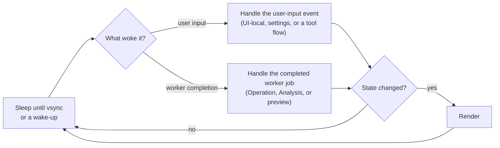
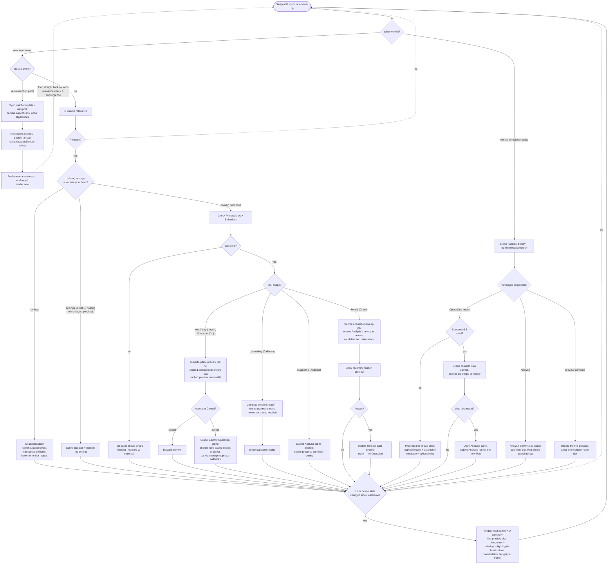
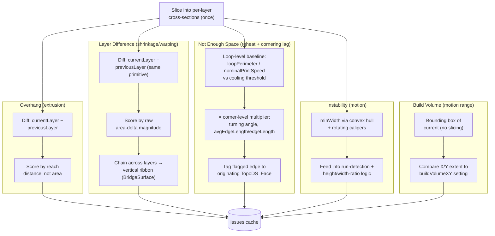
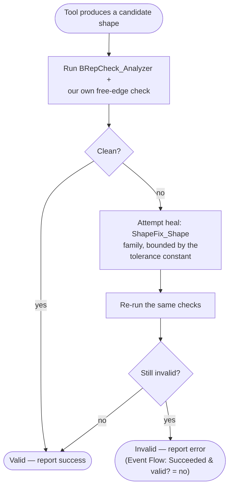

# Architecture

This document defines the domain model, the reasoning behind each decision, and the algorithms that follow from it. Coding conventions and practices (not domain algorithms) live in `practices/project_practices.md`.

**How to read this doc** — written as one continuous narrative, front to back, for a reader with no prior exposure to this codebase: [Product](#product) and [How We Solve It](#how-we-solve-it) introduce the problem and the tools that solve it, [Architecture at a glance](#architecture-at-a-glance) previews every piece in one screen, and [Event Flow](#event-flow) onward builds up the runtime mechanics, data model, and each layer's responsibilities the same way.

Already know this codebase? [Architecture at a glance](#architecture-at-a-glance) doubles as an index — its bullets link straight into the section that covers each piece, so you can jump in without re-reading the narrative build-up.

## Glossary

- **FDM** — Fused Deposition Modeling, the 3D printing process this app targets: melted filament extruded layer by layer.
- **CAD** — Computer-Aided Design; the 3D model a user starts from.
- **OCCT** — Open CASCADE Technology, the geometry kernel this app builds on. Everything under `TopoDS_*` (`TopoDS_Shape`, `TopoDS_Face`, etc.) is an OCCT type.
- **BRep** — Boundary Representation, the way OCCT stores a solid: as its bounding faces/edges/vertices, not a mesh.
- **NURBS** — Non-Uniform Rational B-Splines, the math behind curved CAD surfaces (as opposed to flat, triangulated ones).
- **STEP / STL / OBJ / 3MF** — the file formats Import reads and Export writes. STEP preserves curved BRep surfaces; STL/OBJ/3MF are triangle meshes with no curve information (see [Import](#import)).
- **VBO** — Vertex Buffer Object, an OpenGL buffer holding geometry data on the GPU.
- **TBB** — Threading Building Blocks, the threading library used for intra-tool parallelism (see [Shared](#shared)).
- **HiDPI** — high pixel-density displays (e.g. Retina), where physical pixels and logical UI units diverge.

## Contents
- [Glossary](#glossary)
- [Product](#product)
- [How We Solve It](#how-we-solve-it)
- [Architecture at a glance](#architecture-at-a-glance)
- [Event Flow](#event-flow)
  - [Resizing](#resizing)
  - [Tool panel shapes](#tool-panel-shapes)
  - [Live preview](#live-preview)
  - [Worker-completion handling](#worker-completion-handling)
- [Data](#data)
  - [Session](#session)
  - [Part](#part)
  - [Issue](#issue)
  - [Operation](#operation)
  - [Settings](#settings)
  - [Invariants](#invariants)
- [Architecture Layers](#architecture-layers)
  - [Scene](#scene)
  - [Logic](#logic)
  - [UI](#ui)
  - [Rendering](#rendering)
  - [Shared](#shared)
- [Tools](#tools)
  - [Import](#import)
  - [Analysis](#analysis)
  - [Structure](#structure)
  - [Calibrate](#calibrate)
- [Validation](#validation)
- [Background](#background)
  - [Rejected approaches](#rejected-approaches)
  - [Future & deferred](#future--deferred)
  - [Out of scope](#out-of-scope)
  - [Diagram maintenance](#diagram-maintenance)

---

## Product

You start with a CAD (Computer-Aided Design) model. Getting it to actually print doesn't happen just because it looks correct on screen — overhangs, warping, thin sections that reheat before they cool, and a footprint too large for the bed are all real failure modes an FDM (Fused Deposition Modeling, the layer-by-layer melted-filament printing process) machine runs into, and none of them show up in a CAD viewport.

**Temper** closes that gap between "I have a CAD model" and "it will print successfully." It's a 3D printing analyzer and toolset for FDM users who print functional parts and iterate often, diagnosing problems grounded in FDM physics and providing tools to fix them. It stays on the model side — not a slicer, doesn't need to know about specific printers.

---

## How We Solve It

Here's how these tools fit together in a real workflow. Each section introduces the architecture pieces needed to understand that problem.

### Getting the model in

**Problem:** STL and OBJ files (common mesh export formats) store only flat triangles — you lose any curved surfaces that were in the original design. STEP files preserve those curves as real geometry instead of a mesh, but they need healing (closing gaps, fixing topology) before slicing and analysis.

**Solution:** The **Import** tool handles this. It reads STL, OBJ, STEP, and 3MF (a newer mesh format that can bundle multiple objects and materials in one file) formats. For STEP, curved surfaces come through as real OCCT (Open CASCADE Technology, the geometry kernel this app is built on) shapes — no precision loss. For mesh formats, it reconstructs what flat faces it can (merging coplanar triangles); a future enhancement will attempt to reconstruct NURBS curves (the math behind smooth curved CAD surfaces) from tessellated edges, recovering more precision from mesh inputs. Then **Validation** checks the result and repairs any gaps or orientation issues.

**Architecture introduced:** Import tool.

### The model is too big to print

**Problem:** Your part is larger than the printer's bed. Printing it in pieces requires splitting it intelligently — you want to minimize layer-count increases and stress concentrations at split boundaries.

**Solution:** Analysis's Build Volume detector catches this the same way it catches any other printability problem — comparing the part against the printer's build volume — and links directly to the **Split** tool (not yet implemented), which will divide the model into printable pieces.

**Architecture introduced:** Analysis's Build Volume detector, Split tool.

### Print fails unexpectedly

**Problem:** You print the first version and it fails — unexpected overhang, a thin corner that warps, or a section that's too narrow. These failure modes have physical causes (printer physics, not arbitrary rules), but you need to know where they are on your model to fix them intelligently.

**Solution:** The **Analysis** tool runs a suite of detectors (Overhang, Not Enough Space, Instability, Layer Difference) across your part. Each detector is tied to a specific physical failure mode, so thresholds are tunable rather than magic numbers. It flags *where* on the part each problem is (by face), so you can visualize it in the viewport.

You can also use the **Orient** tool (not yet implemented) to search across candidate bed orientations, reusing Analysis's detectors to find the best print direction automatically.

**Architecture introduced:** Analysis tool, Orient tool.

### Calibration drift

**Problem:** Your printer's output doesn't match CAD dimensions. The part shrinks (uniform), and holes are offset (independent). These two error sources account for nearly all dimensional error in FDM printing.

**Solution:** The **Calibrate** tool takes two simple measurements (a calipers reading on any flat span, and another on a hole) and computes the shrinkage and hole-offset corrections. The future **Tolerance** tool will tag faces as press-fit or smooth-motion-fit, letting you apply different corrections to different surfaces.

**Architecture introduced:** Calibrate tool, Tolerance tool.

### Optimize for weight and print time

**Problem:** You want to reduce filament usage, print time, and weight without weakening the part. The interior material of solid panels (the center, farthest from the edges) carries very little load — it's dead weight.

**Solution:** The **Structure** tool removes interior material and replaces it with diagonal struts. This redirects load from bending (where solid material is inefficient) into axial tension/compression (where material works efficiently), like a truss. Corners stay solid because they brace the structure, and the new geometry is filleted to reduce stress concentration.

**Architecture introduced:** Structure tool.

### Getting the model out

**Problem:** Once every problem Analysis and Structure can catch is fixed, the geometry still has to leave the app in a form a slicer can actually read.

**Solution:** The **Export** tool (not yet implemented) writes the final geometry back out, mirroring Import's supported formats. Since it's the last checkpoint before the file leaves the app, it triggers an Analysis run first — reusing the same diagnostic pass rather than inventing a separate check — so you don't export straight into a problem Analysis already knows how to catch. Whether an unresolved Issue blocks the export or is only an advisory warning isn't settled yet.

**Architecture introduced:** Export tool.

---

## Architecture at a glance

- **[Logic](#logic)** — Tools compute here. Each tool (Import, Analysis, Structure, Calibrate, plus Orient/Split/Tolerance/Export/Cut once built — not yet implemented) has its own isolated worker queue, and can parallelize internally (e.g., Analysis slices across layer ranges in parallel). One tool hanging doesn't freeze others or the UI.
- **[Scene](#scene)** — Orchestrates all work: submits jobs to tool queues, gates commits behind validation, and is the only layer that writes a Part's canonical state.
- **[Validation](#validation)** — Every tool's result is checked once at commit. OCCT supplies repair primitives; Validation dispatches the right one. Invalid results don't commit.
- **[UI](#ui)** — The only layer that listens for input events. Displays results, handles camera/selection, shows progress bars. Read-only except for its own local state (camera, panel layout).
- **[Rendering](#rendering)** — Purely reactive. Reads the Part's current shape, triangulates if needed (cached), and draws. Vsync gates timing; state-change check gates whether it actually renders.
- **[Event Flow](#event-flow)** — Main thread sleeps at vsync or a wake-up from a completed job. Handles whichever woke it, checks if state changed, renders if so. No polling, no busy loops.
- **[Data](#data)** — Defines what each layer owns. A Part owns only its shape (`current`) and undo history; derived state (Issues, picking index, preview slot) is owned by whoever computes it.

---

## Event Flow

Most interactive apps run a continuous loop — read input, update, render, repeat, dozens of times a second, whether or not anything actually changed. This app instead sleeps the main thread until something worth reacting to happens, handles it, and goes back to sleep. Two distinct things can wake it:

1. **User input** — the user did something (moved the camera, clicked a button, entered a value). UI is the only layer that listens for these events, and it's also the one that decides whether a given event is actually relevant to anything — one that wouldn't change any state does nothing further.
2. **A worker job finishing** — a background tool computation (an Import, an Analysis run, a Structure operation) completes. Scene — the layer that owns a Part's canonical state, previewed in [Architecture at a glance](#architecture-at-a-glance) and covered fully in [Architecture Layers → Scene](#scene) — handles this wake directly, with no relevance check first, because Scene submitted that job itself and already knows the result matters.

Both paths converge on the same question before anything is drawn: has anything actually changed since the last frame? If not, the thread sleeps again without rendering. If so, it renders once — synced to the display's refresh via **vsync**, so it never draws more than once per refresh, avoiding tearing and wasted draws — then sleeps again. At a glance:

Two wake sources, each handled, then one shared convergence check before render. Everything below is what "handle the user-input event" and "handle the completed worker job" actually dispatch to — the same loop, every branch:

*This diagram (and four others in this doc) also renders as a static image, [architecture-event-flow.png](architecture-event-flow.png), for viewers without live Mermaid — see [Diagram maintenance](#diagram-maintenance) in Background for what that image is and how to regenerate it after an edit.*

This lets UI handle its own presentation (camera, panel layout, hover) without routing every nudge through Scene, while still funneling every domain mutation through Scene as the one writer — and keeps the main thread idle whenever nothing has actually changed.

### Resizing
A window resize is a deliberate exception to the wake-and-check path above: instead of going through UI's relevance check, an OS-level event watcher intercepts `SDL_EVENT_WINDOW_RESIZED` synchronously and updates state — including rendering — immediately, rather than waiting for the next reactive wake.

This is justified, not a shortcut — deferring to the next polled frame would show a stretched or stale frame for one visible frame during an interactive resize drag, a real artifact, not just a layering nicety being skipped for convenience.

- The viewport update uses physical pixels for HiDPI (high pixel-density displays, e.g. Retina) correctness, while logical size still drives camera/UI math.
- The viewport itself stays a fixed size regardless of panel layout — panels overlay it rather than resizing it, since visual stability of the 3D view matters more than reclaiming screen space when a panel collapses.

### Tool panel shapes
Every tool panel needs its required inputs selected before it can do anything — the diagram above calls this the Prerequisites + Selections gate: if something required is still missing, the panel just shows what's needed (required vs. optional) and waits. Once satisfied, what happens next depends on the tool's *shape* — four patterns, each suited to a different kind of tool:

- **Write** — modifies a Part's `current` (its live geometry, see [Data → Part](#part)):
  - **Modifying** (Structure, future Cut, and Import — which creates a Part instead of modifying one, but follows the same shape) — preview the result, then Cancel or Accept; only Accept actually commits. Accept is disabled while another Operation is already in-flight for that Part: the preview was computed against `current` as it stood at preview time, and if a different Operation commits first, that preview is now stale — accepting it would run the submitted job against the wrong shape and silently discard the in-flight result.
- **Read-only** — `current` stays untouched:
  - **Diagnostic** (Analysis) — submits a job to its worker queue, shows a progress bar, and commits its own Issues cache once done (see [Data → Issue](#issue)).
  - **Calculating** (Calibrate) — ends in copyable results instead of an accept step; there's nothing to commit.
  - **Hybrid** (Orient) — calculates a recommendation, but its Accept step only changes UI-local build-direction state, not an Operation — nothing is committed to the Part.

A settings change isn't part of this classification at all — it skips the gate entirely. It does mutate domain state (so it isn't purely UI-local), but there's nothing to select and no preview to show, so the Prerequisites + Selections gate doesn't apply either. It's its own direct path: Scene updates and persists the value immediately.

### Live preview
While a long-running Operation (see [Data → Operation](#operation)) is still computing, what should the viewport show in the meantime? Two different answers were considered.

**Phase-level snapshots** — showing the shape as of the last completed checkpoint while the next phase computes — work well: a checkpointed operation (one broken into stages with a real, valid shape at each stage boundary — Structure's carve is built this way) produces a genuine intermediate `TopoDS_Shape` at each phase boundary. OCCT shapes are cheap to copy (a handle increment, not a deep copy — see [Shared → Intra-tool parallelism](#shared)), so handing one back to the main thread mid-operation costs almost nothing.

- This needs one small addition to Shared: a future (the usual way a worker hands back a result) only resolves once, so delivering several intermediate shapes over one operation's lifetime needs a separate "latest intermediate result" slot the worker updates between phases instead. Shared owns that slot (see Invariants); Scene/Rendering only read it.
- The slot is protected by a mutex — the worker holds it briefly to write a new shape handle at each phase boundary; the render thread holds it briefly to copy the handle once per frame. Contention is negligible since writes happen only at phase boundaries.

**Continuous frame-by-frame animation** of a single OCCT call in progress isn't achievable on any graphics API: an OCCT boolean or fillet call is an atomic black box with no mid-call hook — there's no valid shape to expose until the call returns, because the shape doesn't exist in any partial form before then. This isn't a rendering limitation waiting to be solved; the data to render simply isn't there yet.

- This isn't a reason to consider Vulkan either: the actual bottleneck here was never render-thread parallelism (this app draws a handful of Parts with cached triangulation — nowhere near the draw-call volume where Vulkan's multithreaded command recording pays off), and switching graphics APIs wouldn't expose OCCT's internal call state regardless.

### Worker-completion handling
When an Operation or Import job finishes, Scene checks **success and validity** before committing anything. Failure — whether the algorithm errored outright, or it ran clean but produced an invalid shape that Validation couldn't heal (see [Validation](#validation)) — shows the standardized error (code, message, optional why) in the same progress bar, rather than silently discarding the result or leaving stale state behind.

On success, Scene commits the new shape as the Part's `current`. If this was an Import, Scene also opens the Analysis panel and submits an Analysis run for the new Part immediately (see [Import](#import)) — the one case where Analysis runs without the user separately triggering it. Otherwise, Analysis exposes its own Issues cache directly rather than handing anything back to Scene (see [Architecture Layers → Logic](#logic) for why Analysis's result path differs from an Operation's), and runs only when the user triggers it. A live-preview-slot update from an in-progress preview job follows this same no-relevance-check path, since it's also Scene-initiated work completing, not user input.

---

## Data

Event Flow used several names — Part, Operation, Issue, `current` — without fully defining them; here's what each actually is. Each entity below is defined by what it owns and nothing more; cross-cutting rules that span more than one entity are gathered in [Invariants](#invariants) at the end instead of being repeated per-entity.

### Session
The workspace. Owns one or more Parts, processed independently.

**Why:** the app has to support more than one Part open at once without their state bleeding into each other — a multi-document workspace, not a single-Part assumption baked into Scene itself.

### Part
The thing the user wants to print. Owns only what defines it:
- `TopoDS_Shape current` — the live geometry
- `vector<TopoDS_Shape> history` — undo stack, per-Part (cheap: OCCT shapes share underlying data)

`TopoDS_Shape`'s own hierarchy (Solid → Shell → Face → Wire → Edge → Vertex — a solid decomposed into its constituent faces, edges, and vertices) *is* the dependency graph for what's inside `current` — there's no separate reference system to maintain. Sub-shape relationships are traversed via `TopExp_Explorer` on demand, and sub-shapes are identified by `TopoDS_Face` value comparison, never raw pointers — pointers go stale the moment a shape is rebuilt.

**Why:** keeping Part this narrow is what makes a single, settled set of ownership rules possible — if Part also held Issues, the picking index, or any other derived state, "who owns this" would need re-deriving per consumer instead of being settled once (see Invariants).

### Issue
An Issue is a specific problem Analysis found, located on a Part by `TopoDS_Face` value (never a raw pointer) — a single face for most detectors, a chain of faces for Layer Difference's vertical ribbon, or no face at all for Build Volume, which is a whole-Part problem rather than a local one. An Issue can also carry a link to another tool (Build Volume links to Split) — clicking it opens that tool's panel directly, instead of (or alongside) highlighting geometry in the viewport. Analysis, a Logic tool, owns Issues — not Part (see [Invariants](#invariants) for why). Concretely, this is a per-Part cache: a list of Issues, plus a pending flag and a stale flag:

- On commit, Scene discards the cache's entries for that Part and sets **stale** — never keeps entries computed against a shape that no longer exists, since some would already reference `TopoDS_Face` values that no longer resolve to anything.
- **Pending** drives the UI progress bar while an Analysis job runs.
- **Stale** is cleared only once a completed Analysis run repopulates the cache against the new `current`. While stale is true, an empty cache means *not yet analyzed*, not *no problems found* — the UI must show these as distinct states, not collapse them (see [Rendering](#rendering)).

**Why:** a flat pass/fail signal can't drive the UI — Analysis needs to say *where* on the Part each problem is and *what kind*, so a user can click an Issue and have the viewport highlight where it is. Tying it to `TopoDS_Face` values, not pointers, is what makes that mapping survive a shape rebuild.

### Operation
A modification applied to an *existing* Part (e.g. Structure). Always produces a new `TopoDS_Shape`, never mutates in place. Pushes `current` onto `history` and replaces it with the result. Undo is a pop.

On failure, an Operation reports one standard shape, not invented per-tool:
- A short, copyable **error code**.
- A short actionable **message** — what the user can do about it.
- An optional longer **why**, shown if there's room.

Import is not an Operation — it has no prior `current`/`history` to act on. It's a sibling concept that constructs a brand-new Part directly (`current` = the imported/healed shape, `history` empty, unless the source file itself carries a persisted original — see [Import](#import)).

**Why:** "always produces a new shape" is what makes undo just a pop off `history` instead of needing a separate undo-log or a deep-copy-before-mutate step — and it's what lets Validation check a result once, at commit, instead of every tool re-verifying state it might have silently corrupted in place.

### Settings
Persisted constants the user can tune (the tolerance constant, default tool parameters, etc.) — the only thing in the app that persists across restarts through a dedicated store. Sessions/Parts still have no general project-file format, since there's no need for one yet at this app's current scope. The one deliberate exception is narrow: Export's embedded-original mechanism (see Background → Future & deferred) persists a single `history` entry inside the exported file itself, not through Settings' store — everything else about a Part (Issues, in-progress tool state, the rest of `history`) still doesn't survive a restart. Settings' own store, same underlying mechanism either way, is surfaced in two places:
- **Global** — most settings, on a general settings surface.
- **Tool-specific** (Structure's `insetMm`, `wallThicknessMm`, Analysis's `buildVolumeXY`) — on that tool's own panel instead, for better discoverability.

**Why:** the tolerance constant and tool defaults need to survive a restart, but Sessions/Parts don't — there's nothing to "resume" for an in-progress print analysis the way there is for a tuned setting, so only Settings gets a persisted store.

### Invariants

- **Derived state is owned by whoever computes it — not by Part, and not by Scene just because Scene triggered the work.** Part owns only what defines it (`current`, `history`). This covers Issues (Analysis), the picking index (Rendering), and the live-preview slot (Shared). A lookup keyed by Part identity costs a negligible hash-map access regardless of which side of this rule it lives on, so this is purely an ownership rule, not a performance one.
- A Part's Issues are always defined in Analysis's cache — possibly empty, never unknown, and never a mix of previous-shape and current-shape entries: Scene discards the cache and sets stale on commit, so an empty cache with stale true means *not yet analyzed*, never *previous shape's results*. The stale flag is written only by Scene (on commit) and only cleared by Analysis (on a completed run); Rendering/UI only read it.
- An Operation always produces a new shape; mutation in place is forbidden.
- The live-preview slot is mutex-protected: writer (worker, at phase boundaries) and reader (render thread, once per frame) each hold the mutex only for the duration of a handle copy.
- Sub-shapes are referenced by value, never by raw pointer — a raw pointer would dangle the moment a shape is rebuilt (see [Part](#part)).
- Scene is the only layer that writes a Part's canonical state (`current`, `history`) and Settings — not the same claim as "Scene owns all state," per the rule above. UI is the only consumer that's purely read-only everywhere.
- A Part's `current` is always valid — validated once at commit (see Validation), never re-checked downstream. Anything reading `current` can trust it unconditionally.

---

## Architecture Layers

Event Flow described *when* things happen; this section describes *who* does each part of the work. The app splits into five layers, each with one clear job and one clear boundary on what it's allowed to touch — Scene orchestrates, Logic computes, UI listens and displays, Rendering draws, and Shared runs the actual worker threads underneath all of them.

### Scene
Owns Session and the operation queue. The only layer that writes to a Part's canonical state (`current`/`history`) — Part itself holds that data (see [Data → Part](#part)), Scene is the sole gatekeeper for changing it.

**Why:** orchestrates, doesn't compute — submits Logic tools' work to Shared's worker thread and commits what comes back onto a Part, without taking ownership of what a tool produces along the way (see Logic). Keeps "deciding what happens to a Part" separate from "computing it."

Also owns the **operation queue** — pending/in-progress Logic work on the worker thread. UI submits to it; rendering just reads a busy flag.

Uses the **tolerance constant** (owned/persisted by Settings, default grounded in real manufacturing/measurement resolution — ~0.001mm, finer than a printer can reproduce or a caliper can read) for two roles, one number feeding both, not picked independently per call site:
- Our own geometric comparisons — degenerate-loop checks, eligibility thresholds.
- The tolerance argument passed into OCCT APIs that accept one — sewing, face-fixing.

### Logic
Owns each tool's own domain computation and any tool-specific derived cache — Analysis's Issues, Structure's carve algorithm, Calibrate's correction formulas, Import's facet/sew/unify pipeline. This is where `src/logic/` (Analysis, Structure, Calibrate, Import, GeometryOps) actually runs.

**Why a separate layer:** distinct from Scene, which orchestrates but doesn't compute. Scene triggers Logic running and invokes it via Shared's worker thread, but that doesn't make them the same layer — what happens to a tool's result still depends on the tool:
- **Operations / Import** — hand a new shape back for Scene to commit.
- **Analysis** — exposes its Issues cache directly; nothing handed back to Scene.
- **Calibrate** — results are just read by UI; nothing committed at all.

A tool's result isn't "successful" until it's valid — see [Validation](#validation), the shared mechanism every tool's commit path goes through.

### UI
The only layer that listens for input events, and the only one that decides whether an event is relevant (see Event Flow). Drives imports, submits operations to Scene's queue, displays Issues and Part state. Never touches geometry directly. Owns the **camera** — it's what the user directly manipulates, so it's UI-local state, not a rendering decision, even though it feeds the render.

Resizing is a deliberate exception to the normal event flow — see Event Flow → Resizing.

**Repositioning.** Panels and HUD elements don't use fixed pixel coordinates; each resolves its position from anchors (screen edges/corners) plus a content-box model (margin + padding + content, computed bottom-up). Resizing the window re-resolves every panel's box top-down, so panels reflow instead of needing per-resolution layout logic.

- Each parent element defines a local coordinate system; children position relative to their parent's, recursively — a standard scene-graph layout, not per-element absolute coordinates.
- Margin and padding are reserved space no child content ever occupies — enforced by how each child's position is computed from its parent's content-box, not by clipping content that overflows into that space afterward.
- The **viewport itself stays a fixed size** regardless of this — panels overlay it rather than resizing it, since visual stability of the 3D view matters more than reclaiming screen space when a panel collapses.
- Only an actual window resize retriggers the camera aspect-ratio/projection update, never a panel layout change alone.

**Sizing.** Under space pressure, elements collapse in priority order rather than uniformly shrinking or clipping:
- Each element has a priority rank; lower-priority elements collapse first.
- Each collapse state has its own minimum size; the overall minimum is whatever the deepest non-collapsed element needs.
- If available space drops below the current minimum, collapse the lowest-priority element next, and recompute.
- What "collapse" means is element-specific (hide entirely, icon-only, re-wrap) — not one uniform behavior.

Units are computed from resolution and display scale (`SDL_GetWindowDisplayScale`), not raw pixels, so an element's *visual* size stays consistent across screen densities.

Tool panels split into modifying/calculating/hybrid shapes, with settings changes taking their own direct path — see Event Flow → Tool panel shapes. Live preview during a running operation is phase-level only, not continuous — see Event Flow → Live preview.

**Hover-to-render.** Anywhere the UI displays a reference to a sub-shape (an Issue's location, a selected face), hovering it highlights that feature in the viewport. This is the same picking index (`TopTools_IndexedMapOfShape`) Rendering owns for click-to-pick, just driven in reverse — no new infrastructure needed.

**Multiple open panels.** A tool can open another tool directly — Import opens Analysis on completion, a Build Volume Issue opens Split (see Tools → Analysis) — so more than one tool panel can be open at once. Rather than a second, parallel layout system for stacking panels in a column, this reuses the collapse mechanism Sizing already has: opening a tool this way focuses it (full space) and collapses whichever panel had focus before, to that panel's own defined collapse state — a breadcrumb trail back through the chain (Import → Analysis → Split), not a fixed two-panel limit.

Losing focus this way is not the same as being dismissed: a panel collapsed only because a chain-link opened another tool is still open, just visually shrunk, so any in-flight work it's tracking keeps running undisturbed (see Shared's cancellation trigger).

### Rendering
Purely reactive: no logic, no decisions, just reflects state Scene/UI already settled. Two separate gates, both required:

- Vsync gates *when* a draw can happen — never more than once per refresh, in sync with the display, avoiding tearing and wasted draws between refreshes.
- The state-changed check (Event Flow → convergence) gates *whether* it actually does — no redraw if nothing changed since the last frame, no per-frame recompute.

Owns triangulation — reads cached triangulation from OCCT's faces, running `BRepMesh_IncrementalMesh` lazily on first draw if missing. Owns the **picking index** (`TopTools_IndexedMapOfShape` per Part) for mapping viewport clicks back to sub-shapes, rebuilt against `current` after every commit.

Between a commit and the user re-running Analysis, the Issues cache is empty and marked stale (see [Data → Issue](#issue)) rather than holding entries computed against the previous shape — those entries could reference face values the new shape no longer has, and there's no reliable way to tell which surviving ones are still meaningful. An empty stale cache and a genuinely clean result both show zero Issues, so the UI must surface the distinction (*not yet analyzed* vs. *verified clean*) rather than let one be mistaken for the other.

**Buffer updates.** GPU geometry lives in two global VBOs (one for triangle meshes, one for wireframe lines), each mapped once at startup with `GL_MAP_PERSISTENT_BIT | GL_MAP_WRITE_BIT | GL_MAP_COHERENT_BIT` and double-buffered (two VBOs, or one split in half). Each Part occupies a tracked chunk (vertex and index offsets) within them.

Packing splits into two phases, the same isolation principle Intra-tool parallelism uses for read-only OCCT work: do the slow part on a private copy nobody else can see, and only touch shared state for the fast, bounded part.

- **Pack** — the background thread builds the new chunk's vertex/index data into its own private staging buffer, plain CPU memory the GPU and render thread never touch. No synchronization needed here at all, for the same reason a read-only OCCT job is safe on a copied handle: nothing else can observe a private copy mid-write.
- **Publish** — once packing is complete, the background thread copies the staged data into the actual persistent-mapped VBO (Vertex Buffer Object — a GPU-resident geometry buffer) chunk in one bounded bulk copy. This is the only step that needs the fence: `glFenceSync` after draw calls marks when the GPU started reading a half; the main thread checks the fence and signals the background thread (via a condition variable) when that half is safe to overwrite. Because publish is a straight memory copy — no packing logic, no variable-cost work — its duration scales with data size alone, so it isn't the part of the pipeline that risks running long.
- Dirty-tracking: a per-Part dirty set (`geometryDirtySolids`) drives targeted partial updates (only the affected chunk is rewritten); a `geometryDirtyAll` flag triggers a full repack and is set only when the chunk layout changes (a Part added, removed, or its mesh size crosses a boundary).

**Z-fighting.** The actual symptom is chaotic flicker: when two faces are this close in depth, which one wins the depth test can resolve inconsistently per-pixel or per-frame as the camera moves, reading as visual noise rather than a clean edge — not a clean, consistent "one face disappears." This app hits the precondition often: small faces nested inside or coplanar with a larger host face (a classified sub-face, a Structure preview overlay).

The fix: when two faces are within the tolerance constant's depth range of each other (a genuine tie, not just nearby in depth), bias whichever has the smaller projected screen area toward the camera — deterministic, so the flicker has a fixed winner instead of an unstable one. That also keeps the smaller face reliably visible and pickable as a side effect, rather than it winning or losing at random. This only resolves real ties — it doesn't reorder normal, legitimately depth-separated geometry, since there's no tie to break there.

**Fog for depth cueing** — a separate concern from z-fighting: a perceptual aid helping the user visually judge which face is in front, not a fix for a rendering artifact.

**Reference grids.** The viewport draws a ground-plane grid at `buildVolumeXY` spacing (see [Settings](#settings)), giving a visual sense of scale against the printer's bed. A tolerance grid reuses the same primitive at the tolerance constant's spacing instead, in a distinct color — making that otherwise abstract number visually graspable next to real geometry.

The tolerance grid is culled unless it's actually resolvable: below roughly one line per two screen pixels (the Nyquist limit for a line pattern), it reads as aliasing noise, not a scale reference. It only draws once the camera is zoomed in close enough to clear that threshold — in practice, far past the zoom level where the bed grid itself is still legible — so it needs no separate logic to track what the user's looking at; the visibility check alone puts it wherever they've zoomed in.

### Shared
Shared is what actually runs Logic's computations — every "submit a job" mentioned above ends up here. Logic work runs on worker threads, isolated **per tool** — not one shared pool. The main thread owns UI and rendering and never blocks.

Each tool owns its own queue and worker(s), not only because OCCT can hang (rare — effectively a bug on OCCT's own side when it happens), but because a tool's own algorithm can too — a bug or pathological case in one tool's code must not be able to starve another tool's queue. Structure's carve runs on its own isolated runner precisely for this reason: a stuck case there would otherwise starve Import/Analysis's shared queue, a real precedent, not a hypothetical one. This generalizes that pattern to every tool instead of leaving it a one-off special case.

**Algorithm, per tool's queue:**

1. Scene submits a unit of work to that tool's task queue (`fn` receives a cancellation token it can check cooperatively during long calls). Submission is non-blocking — it enqueues the job and immediately returns a handle wrapping a future; the caller does not wait. Queue behaviour differs by job type:
   - **Operation jobs queue behind** any in-flight job for that Part — safe, since Operations are discrete and ordered.
   - **Preview jobs cancel-supersede** — a new preview submission flips the in-flight preview's cancellation token and replaces it, because the new input always makes the old preview result irrelevant; queuing stale previews would leave the user waiting through results they'll never use.
2. That tool's worker(s) pull queued jobs FIFO and run them off the main thread.
3. On completion, the job wakes the main thread's blocked event wait — so the main thread discovers the result without polling every frame.
4. The main thread polls the handle (non-blocking by default) to check if the result is ready, and if so commits it — e.g. Scene swaps in the new shape (once validated, see [Validation](#validation)).
5. Cancellation is cooperative only: requesting cancellation flips a flag; the running task must check it itself to actually stop early — there's no preemption.
   - On the UI side, the user explicitly collapsing or dismissing a tool panel is the natural cancel trigger. A panel that collapses only because focus moved to a newly-opened tool (see UI → Multiple open panels) is not dismissed — it's still open, just visually shrunk — so it doesn't cancel anything.
   - Cancellation isn't guaranteed instant either way, so the UI must reflect that honestly: show the cancellation as pending until the worker actually stops, rather than assuming immediate success.
6. Teardown never blocks the main thread: destroying a handle whose result isn't ready yet gets a bounded grace wait (about one frame), then any further wait is deferred to a detached thread instead of blocking — some calls can hang indefinitely, and blocking on cleanup would freeze the UI.
   - True OCCT hangs are rare (normal slow cases exit at the next cooperative cancellation check); per-tool isolation already limits the blast radius to one queue. Not worth process isolation or `pthread_cancel` unless this becomes a real user-reported issue.

**Intra-tool parallelism:**

Not all OCCT operations have the same thread-safety constraints. The distinction that determines whether an operation can be parallelized:

- **Modifying** (boolean cuts, fillets, sewing, anything producing a new shape) — serialized within the tool's worker. These write new `TopoDS_Shape` objects and must not run concurrently.
- **Read-only** (slicing, shape traversal, cross-section computation) — safe to parallelize. They only read the input shape; `current` is never touched.

The safety mechanism for read-only parallelism: copy the `TopoDS_Shape` handle once per worker thread before dispatching, on a single thread. `TopoDS_Shape` copies are O(1) — a handle increment, no geometry duplication. After dispatch, each thread holds its own handle with no concurrent reference-count manipulation.

**TBB** (Threading Building Blocks, `tbb::task_group`/`tbb::parallel_for`) is the threading primitive for intra-tool parallelism — not `std::async`. Analysis can be triggered repeatedly across a session, so raw thread creation per run compounds; TBB's thread pool reuses threads across runs. Use `tbb::task_group` for fan-outs (Analysis's detectors), `tbb::parallel_for` for range parallelism (slice layer ranges). Not `tbb::flow::graph` — the DAGs involved are at most two levels deep and don't warrant it.

Analysis is the primary beneficiary: the slice step runs sequentially on the OCCT thread (or in parallel across layer ranges with pre-copied handles), then hands off raw geometry (plain 2D point arrays — no OCCT) to four detector threads via `tbb::task_group`. Structure's pipeline is mostly modifying OCCT operations and gains little from this model currently.

---

## Tools

Collectively, these are the **Logic** layer (see Architecture Layers → Logic) — Scene orchestrates and commits, Logic computes. Open items and future tools are in [Background](#background).

### Import
Not an Operation — it has no prior Part to act on. Constructs a brand-new Part directly. Supports STL, OBJ, STEP, and 3MF.

**Algorithm:**

1. **STEP** imports as native BRep (Boundary Representation — a solid stored as its bounding faces/edges, not a mesh) via `STEPControl_Reader` — true curved surfaces, no conversion needed.
2. **STL/OBJ/3MF** go through facet → sew → unify:
   - One planar face per triangle (`BRepBuilderAPI_MakeFace`).
   - Sewn into a shell (`BRepBuilderAPI_Sewing`).
   - `ShapeUpgrade_UnifySameDomain` merges adjacent *coplanar* triangles into larger flat faces.
3. That only recovers flat faces — a tessellated cylinder stays a faceted prism. Reconstructing curved faces (fitting NURBS curves/surfaces to the tessellation) would recover that precision, but no surface-fitting step exists yet — an unimplemented future enhancement, not a current capability (see Background → Future & deferred for why it's still open).

**Hand-off to Analysis.** A freshly imported Part has no prior Issues cache, so on a successful commit Scene opens the Analysis panel and immediately submits a run for the new Part — a deliberate exception to Analysis's user-triggered rule (see [Analysis](#analysis)). This is safe specifically because Analysis is read-only and diagnostic: there's no Accept gate to skip, unlike a Modifying tool. It doesn't generalize to Structure or Split, which still require an explicit Accept no matter how their panel was opened.

**Reading back an exported original.** A `tempered.stp` file (written by Export, see Background → Future & deferred) has an embedded pre-Operation original that seeds the new Part's `history` with that one entry instead of starting empty — Undo reaches back to the true original even after a save → close → reopen round-trip. Everything else about Import proceeds as normal; the embedded data is just extra STEP-comment content any other STEP reader already ignores.

### Analysis
Diagnostic. Runs when the user triggers it — except immediately after Import, which triggers a run automatically as part of handing the new Part off for review (see [Import](#import)) — computing its per-Part Issues cache (see [Data → Issue](#issue)). Full derivation and uncalibrated constants: [analysis-redesign.md](todo/analysis-redesign.md).

**Why:** each detector ties to a specific physical cause in the FDM process. New detectors should be justified the same way, not bolted on ad hoc:

- **Overhang** (extrusion) — nozzle pressure/momentum pushes unsupported material sideways. Not gravity-driven — happens upside-down too.
- **Not Enough Space** (reheat + cornering motion lag) — two independent, compounding mechanisms:
  - *Reheat* (loop-level): a small loop has a short perimeter, so the nozzle revisits it before it cools. Severity tracks loop size/shape, not shrinkage — no global factor fixes it, so it must be flagged geometrically.
  - *Cornering motion lag* (corner-level): the nozzle decelerates into a sharp corner; extrusion lags the velocity change (what pressure/linear advance imperfectly compensates), over-extruding locally, independent of loop size.
- **Instability** (motion) — a tall thin section topples under disturbance, like Euler buckling: a column yields along its weakest axis, not its average width.
- **Layer Difference** (shrinkage/warping) — differential cooling shrinks the part. Uniform across the whole part (unlike reheat), so Calibrate's single scale factor corrects it — Analysis just flags where the area-delta is large enough to signal risk.
- **Build Volume** (motion system range) — the print head's motion system has a fixed travel range set by the bed's physical X/Y extent, so geometry wider than that footprint is mechanically unreachable — a hard travel limit, not a print-quality risk like the other four.

**Algorithm, per Part:** one shared slicing step feeds four *independent* detectors — not a sequence; 2-5 below don't depend on each other, only on 1. A fifth, Build Volume, skips slicing entirely and runs directly off the Part's shape:

*Each detector's internal compute → score (→ map) steps are right there in the box — nothing is split into a second diagram.*

1. Slice into per-layer cross-sections once, shared by all four detectors below.
2. **Overhang**:
   - **Diff** — boolean diff `currentLayer − previousLayer` gives the unsupported region directly.
   - **Scoring** — threshold on **reach distance** (how far the diff region extends past the supported edge), not area: a long thin sliver that cantilevers far is the failure case, not a short wide strip with more area but little reach. Area stays as a secondary signal.
3. **Layer Difference**:
   - **Diff** — the same diff primitive as Overhang (`currentLayer − previousLayer`).
   - **Scoring** — thresholded on raw area-delta magnitude instead of reach: warping is about how much cross-sectional area shifted, not which direction it's unsupported in.
   - **Mapping** — not a single-face defect: flagged regions chain across consecutive layers into a vertical ribbon (`BridgeSurface`), since warping runs through the part's height, not one face.
4. **Not Enough Space** — per loop: `risk = loopReheatRisk(loopPerimeter, nominalPrintSpeed) * (1 + cornerDwellBonus)`.
   - **Loop-level baseline** (`loopReheatRisk`) — estimated revisit time (`loopPerimeter / nominalPrintSpeed`) compared against a cooling threshold.
   - **Corner-level multiplier** (`cornerDwellBonus`) — scores each corner's turning angle, and each edge's length *relative to the loop's own average* (`avgEdgeLength / edgeLength` — the short edge must be the denominator, or the ratio backwards-favors long edges).
   - **Face mapping** — each corner is tagged with its originating `TopoDS_Face` at slice time, so the flag becomes a clip region on that face, not the whole loop.
5. **Instability**, per loop:
   - **Computation** — `minWidth` via convex hull + rotating calipers (a convex polygon's minimum width is always perpendicular to one of its hull edges, so only as many directions as hull edges need checking).
   - **Scoring** — feed `minWidth` into the run-detection + height/width-ratio logic, flagging a run of layers whose minimum width is small relative to how tall the run is.
6. **Build Volume** — compute the Part's axis-aligned bounding box directly from `current` (no slicing needed) and compare its X/Y extent against `buildVolumeXY` (Analysis's own tool-specific setting; see [Settings](#settings)). Z isn't checked — gantry travel comfortably exceeds any practical part height. An oversized Part gets a single, Part-wide Issue (no `TopoDS_Face` — the whole geometry doesn't fit, not one region of it) that links directly to the **Split** tool instead of highlighting a location in the viewport.

### Structure
Optimization, the opposite direction from Analysis: removes material/weight/print-time from an over-built region without weakening it. An **Operation** — produces a new shape via OCCT carve/fillet/offset/boolean primitives (`GeometryOps`).

**Mechanism:** the tool auto-selects every eligible face (near-horizontal, large enough span) — the user excludes faces, rather than picking them in. Per remaining face: inset the boundary by `insetMm` (holes get an outset, untouched), carve away the interior (vertical prism subtraction), then brace the void with diagonal struts anchored to the remaining wall band.

The carve is always **vertical** — never angled — so it never introduces an overhang. A carve that left an unsupported angled wall would just trade one defect for another, so this constraint is load-bearing, not a shortcut.

**Why:**

- **Bending → axial conversion.** A solid panel resists load mainly via bending stiffness (scales with thickness³) — material in the middle of a thick slab does little work relative to material at the boundary. Diagonal struts redirect that load into axial tension/compression instead, which carries load per unit mass far more efficiently — the same principle behind trusses and I-beams.
- **Corners outlast walls.** Not because the filament there is stronger — it's the same material everywhere. A flat wall span is like a simply-supported plate: unsupported mid-span, so it deflects most there. A corner is braced on two sides, like an L-bracket vs. a flat sheet — stiffer by geometry, not material. FDM's flexible filament and weak inter-layer bonding make this more *visible*, but the cause is leverage, not "weak walls." This is also why inset distance, not material choice, is the real safety lever.
- **Fillets at strut/wall junctions cut stress concentration.** A sharp internal corner is a textbook stress riser — a real, quantifiable factor (2-3x vs. a filleted one). Real mechanical work, not cosmetic.

**Algorithm, per eligible face:**

1. Project the face onto the horizontal world-XY cutting plane (slanted faces project tilted, via an affine shear, so a circular hole still carves a cylinder wall instead of a polygon prism).
2. Offset by `insetMm`: outer boundary inward, hole loops outward (untouched).
3. Place an anchor at each inset-edge midpoint, carrying that edge's inward normal.
4. Generate strut candidates between anchor pairs, dropping any that cross a ring boundary (outer or hole) or whose midpoint falls outside the outer ring or inside a hole's void.
5. Clip each surviving candidate against its own walls' real geometry (an OCCT boolean, not a 2D approximation) — an end that doesn't land squarely on the wall it's connecting to **tapers** narrower than `insetMm/2` instead of being rejected outright, since a tapered strut is still buildable and may be the only option at that anchor. The taper starts as late as possible: find where the strut's centerline crosses the wall's real boundary — the point a zero-width strut would just reach — and only begin narrowing from there, so the strut holds full width for as much of its length as the wall geometry allows rather than tapering gradually over its whole span.
6. Rank valid pairs on four terms:
   - Combined length.
   - Bisector alignment with the edge's inward normal.
   - **Closeness to 45° from the walls each strut touches** — the mechanically optimal angle for the bending→axial conversion above, so it needs its own term, not just length/alignment.
   - **Taper penalty** — a tapered tip carries less material than its length alone suggests, so it loses to a full-width alternative when one exists, but still wins over no strut at all.
7. Land surviving strut quads on the real wall geometry, fuse overlapping ones, then **notch them out of** the offset footprint — the void is footprint *minus* struts.
8. Fillet every corner by `insetMm` (radius = inset, 1:1).
9. Weight-aware filter: per disjoint void pocket, compare wall-skin cost (`perimeter * wallThicknessMm`) to the pocket's own area. Fill back to solid if skinning costs more than the pocket saves.
10. Cut the solid by the remaining voids: full Z slab for near-horizontal faces, `min(face Z)` to solid top for slanted ones.

### Calibrate
Diagnostic-adjacent. Read-only — never mutates `current`, not an Operation, no history entry.

**Why:** a tool to automate tuning printer accuracy, distilled to the two corrections that account for nearly all of it in practice: shrinkage (Contour) and an unexplained hole-specific offset (Hole).

**Algorithm:**

1. User picks two faces: both perpendicular to the build axis (keeps the measurement in-plane, independent of Z calibration) and parallel to each other (a caliper reading only means something between parallel planes).
2. Classify the pick as **Contour** or **Hole** by topology (does either face touch a hole-inner-edge). Can't mix Contour with Hole — that conflates two distinct, independently-tuned error sources.
3. Compute the nominal CAD span: perpendicular distance between the two picked planes.
4. User measures the print with calipers, enters the value.
5. Apply the matching correction:
   - **Contour**: `contourScale = nominal / measured` — a ratio, since shrinkage scales proportionally with the part.
   - **Hole**: `holeRadiusOffsetMm = 0.5 * (nominal - measured)` — an absolute offset, since hole error doesn't scale with diameter the way Contour error scales with span.

---

## Validation

A tool's result isn't "successful" until it's valid. Validation happens once, at the [commit](#operation) step — the moment a tool's finished result is about to replace a Part's `current`, not at any intermediate step inside a tool's own algorithm. It's never re-checked afterward, so anything reading a Part's `current` (Analysis, Rendering, future tools) can trust it unconditionally. Lives in `GeometryOps` as a shared utility every tool's commit path calls, not reinvented per-tool — the same pattern `GeometryOps` already follows for other generic OCCT primitives (offset, fillet, boolean, ring math).

**Why:** OCCT operations (booleans, fillets, mesh-to-BRep conversion) can produce shapes that are topologically well-formed by OCCT's own rules but geometrically broken in ways that corrupt slicing or printing if left uncaught. Validating in one shared place, rather than each tool inventing its own ad hoc check, is what makes the "trust `current` unconditionally" guarantee actually hold.

OCCT's `ShapeFix` package supplies the actual repair *primitives* — closing a gap, fixing a curve-on-surface mismatch, correcting orientation. We don't reimplement geometric healing; that would be reinventing a CAD kernel. What's ours is the **dispatch**: deciding which specific fixer applies to which detected problem, what tolerance bounds it, and what happens if it still fails afterward. There's no one generic "fix it" call — each type below routes to a different tool, on purpose.

**Types & fixes:**

- **Not watertight** — a free edge (used by only one face) means the shell doesn't enclose a defined volume; Analysis can't slice an open shell into meaningful cross-sections.
  - Detection: build an edge→face adjacency map (`TopExp::MapShapesAndAncestors`) and flag any edge whose face count is 1 instead of 2.
  - Fix: re-run a sewing pass (`BRepBuilderAPI_Sewing`, the same tool Import already uses) at the tolerance constant's value — the same mechanism, just applied again post-operation, snapping free-edge endpoints that are only slightly apart.
  - Unrecoverable if the gap is wider than tolerance — that's a real hole in the source, not a numerical artifact, and gets reported rather than forced shut.
- **Inconsistent orientation / self-intersection** — face normals disagreeing about which side is "outside," or a trimmed surface intersecting itself.
  - Detection: `BRepCheck_Analyzer`, walking the shape and reporting per-sub-shape status.
  - Fix: `ShapeFix_Face` (one bad face) or `ShapeFix_Shape` (shape-wide) re-derives consistent orientation and, where possible, re-trims a self-intersecting surface along the intersection curve — the exact mechanism already proven for Structure's fillet path (`ShapeFix_Face` inside `FilletFaceWithChFi2d`), generalized here instead of staying that one tool's special case.
  - Unrecoverable if the self-intersection is severe enough that re-trimming can't produce two well-bounded faces — rare, but possible after an extreme boolean.
- **Tolerance violation** — two points meant to be coincident (a sewing seam, a boolean cut boundary) sit farther apart than the shape's tolerance.
  - Detection: `BRepCheck_Analyzer`'s tolerance-related statuses, or comparing a known-coincident pair directly against the tolerance constant.
  - Fix: `ShapeFix_Shape`'s gap-closing, explicitly bounded to the tolerance constant's value — healing can never widen the *effective* tolerance beyond what we've already decided is acceptable elsewhere, so it can't quietly make the model less precise than the rest of the app assumes.
- **Degenerate sub-shapes** — zero-area faces, zero-length edges.
  - Detection: area/length checks per face/edge against the tolerance constant.
  - Fix: removed rather than repaired — there's no meaningful fix for a sub-shape with no real extent — followed by `ShapeUpgrade_UnifySameDomain` to re-merge whatever coplanar faces the deletion exposed.

**Not a type:** a sub-shape shared by 3+ faces (e.g. two faces resolved out of a self-intersection by splitting along the intersection curve, which legitimately produces this).

- `BRepCheck_Analyzer` doesn't flag it — it's checking BRep consistency, not manifold-ness for printability, and there'd be nothing for `ShapeFix` to fix since the data structure is correct.
- Rejecting it would also contradict the self-intersection fix above: that fix's correct output *is* this shape.
- If a near-zero-width pinch ever matters physically, that's an Analysis concern (Instability's `minWidth` already watches for vanishing cross-sections), not a Validation one.

**Algorithm:** check → if clean, done → if not, dispatch to the matching fixer → re-check → still broken is the "no" branch of `Succeeded & valid?`, healed is "yes".

1. Run `BRepCheck_Analyzer`, plus our own free-edge check (manifold/printability concerns it doesn't cover).
2. Clean → done, report success.
3. Not clean → dispatch to the matching fixer from Types & fixes above — which problem determines which `ShapeFix` tool, not one generic call — bounded by the tolerance constant.
4. Re-run the same checks on the healed result.
5. Still invalid → report the standardized error, don't commit (Event Flow: `Succeeded & valid?` = no). Otherwise → report success, commit.

---

## Background

Design decisions that didn't make it in, open work, and explicit non-goals. Not needed to understand the current architecture — context for why it's shaped the way it is.

### Rejected approaches

**Shader-based tessellation (Rendering):** considered as a replacement for `BRepMesh_IncrementalMesh` — faster, but it means re-implementing OCCT's surface evaluation (planes, cylinders, NURBS, trimmed surfaces) in GLSL, for limited hardware support — and no profiling shows CPU-side triangulation is actually a bottleneck at this app's scale (a handful of Parts, cached results). Revisit only if that changes.

**Elephant's foot correction (Calibrate):** a third correction, alongside Contour and Hole, was considered and dropped. It needs a genuinely different pick interaction (two *edges* on one cap, vs. two *faces* for Contour/Hole — a structurally separate interaction model, not a UI variation), and unlike Contour/Hole error it's fixable after the fact via post-processing, so it wasn't worth the added interaction complexity.

**Concurrent per-tool runs on one Part (Shared):** considered running two tools concurrently on one Part's disjoint faces, if each can prove it never touches the other's faces. Doesn't hold up for two reasons:

- OCCT's coplanar-merge/topology-rebuild steps can touch neighboring faces even when a carve's intent is local, so disjointness is hard to prove in the first place.
- Even if proven, two independently-computed results still need merging back into one `current` afterward, which OCCT has no general primitive for.

Most realistic same-Part tool pairs aren't parallelism candidates anyway: Analysis needs a stable `current` to produce meaningful results so it can't run concurrently with an in-flight Operation, and Calibrate is synchronous/read-only already.

### Future & deferred

**Future tools** — not designed yet; it'll be a while before either is picked up:
- **Tolerance** — clearance/fit adjustment between mating parts. Likely scoped to face-tagging (user marks press-fit/smooth-motion-fit faces) rather than full assembly modeling, lighter-weight than tracking relative Part transforms. 3MF's multi-object support could be a future source of relative positioning if that ever matters.
- **Cut** — divides an oversized part into printable pieces. The one tool that would be allowed to suggest an explicit fix rather than just flag a problem.
- **Export** — writes the final geometry out, mirroring Import's formats, and triggers an Analysis run first (see Tools → Import → Hand-off to Analysis for the same read-only-triggers-are-safe reasoning). For STEP output, also embeds the Part's pre-Operation original shape (`history`'s first entry, see [Data → Part](#part)) inside a standard STEP comment block — a fully spec-conformant `.step` file any STEP reader opens normally, written with a `tempered.stp` extension so Temper itself recognizes it and can round-trip Undo history through it. STL output (`.stl`, no `tempered.stl` variant) carries no such payload: STL has no comment mechanism to embed it in, and isn't precise enough to make a lossless original worth preserving through it anyway. Open question: whether an unresolved Issue blocks the write or is only an advisory warning.

**Deferred:**
- **Orient** — not yet implemented. Re-runs Analysis's detectors across candidate bed orientations, recommends/previews whichever minimizes overhang/instability/layer-difference signals; changes build direction, not the shape. The orientation-search itself (how candidates are generated/scored beyond reusing Analysis's detectors) isn't designed. Open question whether accepting a recommendation needs an Operation/history entry, or is purely UI-local state like Calibrate's build-direction vector.

**Per-tool open items:**
- **Analysis** — Not Enough Space's cooling threshold and corner-multiplier weight are uncalibrated, pending print experiments. OCCT boolean cost on continuously-changing cross-sections is an open perf risk — profile before picking a fix. See [analysis-redesign.md](todo/analysis-redesign.md).
- **Import** — a scan-mesh format (PLY) is a candidate addition, not yet confirmed; drop it if it turns out complex, since it's a nice-to-have, not core. Separately, an optional "attempt curve reconstruction" toggle (off by default, recovering only flat faces; on, attempts to fit arcs/curved surfaces from the tessellation) depends on a mesh-to-BRep surface-fitting capability that doesn't exist yet — no confirmed turnkey OCCT solution for it.

### Out of scope

- Printer-specific configuration (would require building a slicer)
- Suggesting fixes for arbitrary problems (too complex; only Cut addresses size)
- Dependency reference graphs (replaced by OCCT traversal)

### Diagram maintenance

Each Mermaid block in this doc (Event Flow's overview, Event Flow's detailed loop, Architecture at a glance's overview, Analysis's algorithm, and Validation's) is its own source of truth, kept separately editable. [architecture-event-flow.png](architecture-event-flow.png) is one combined generated snapshot of all five, for viewers that don't render Mermaid live — not five separate files, so there's one image to find.

- The other four diagrams render off to the side of the main loop, each in its own labeled box — none graph-connected to each other.
- Analysis's diagram includes its detectors' internal steps directly inside each detector's box — deliberately not split into a second diagram, since that split read as "missing" rather than "more detail available" to a reader without the surrounding context.

**Regenerate after editing any of the five:**

1. Extract each block, wrap the other four in labeled subgraphs nested inside one outer `Side` subgraph, link `Main ~~~ Side` (an invisible Mermaid edge — layout hint only, draws nothing) so the renderer places them beside the main loop instead of stacking everything vertically.
2. Render the combined source once: `npx -y @mermaid-js/mermaid-cli -i <combined .mmd> -o architecture-event-flow.png -b white -w 7000 -s 2`.
3. High resolution so it stays readable when zoomed; if your viewer always shrinks images to a fixed thumbnail, open the file directly rather than relying on an inline preview.

Node/subgraph IDs must be unique across the *entire* combined source, not just within one diagram's original block — Mermaid silently merges same-named nodes/subgraphs from different diagrams into one, which is what caused the Not Enough Space detector to render outside its own group the first time (its subgraph ID collided with the fan-out diagram's `NES` node).
